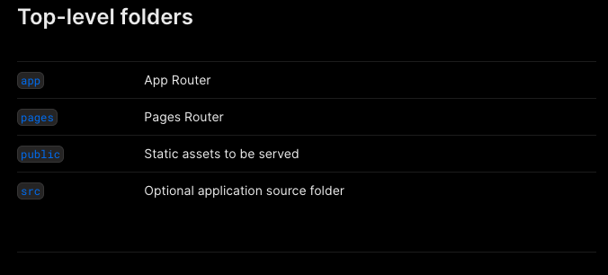
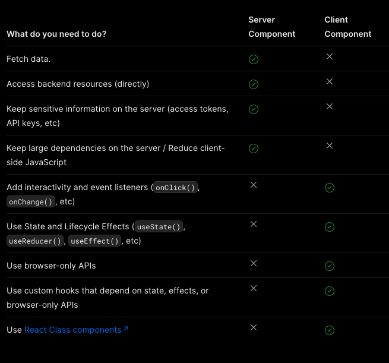

# next-js-sample-website

## Next project structure

Top level folders



Top level files 


### Server and client side rendering

A ideia é que, através da componentização de elementos, é possível que se faça o render do lado do servidor e do lado do
cliente, dependendo da necessidade de interação que cada componente da tela apresenta. Ou seja, no caso de componentes que
apresentam conteúdo estático, é possível fazer o render do lado do servidor, enquanto que, no caso de componentes que 
apresentam conteúdo dinâmico, é possível fazer o render do lado do cliente.

Nesse sentido, a principal ideia de adicionar o render no server side, seria diminuir a necessidade de processamento do
lado do cliente, uma vez que o conteúdo já estaria renderizado no lado do servidor, e, portanto, não seria necessário
que o cliente fizesse o processamento do mesmo em seu browser, tornando mais rápido o carregamento da página.

Por padrão, todos os componentes que estiverem dentro do `App Router` serão renderizados no lado do servidor. Logo, caso
queira que um compoente fuja desse padrão e seja renderizado no lado do cliente, é necessário que use a tag `use client`
para que o mesmo seja renderizado no lado do cliente, como no exemplo abaixo:

```jsx
'use client'
 
import { useState } from 'react'
 
export default function Counter() {
  const [count, setCount] = useState(0)
 
  return (
    <div>
      <p>You clicked {count} times</p>
      <button onClick={() => setCount(count + 1)}>Click me</button>
    </div>
  )
}
```

Não é necessário definir o `use client` em todos os arquivos, pois o next considera que todas os módulos importados daquele 
componente também serão renderizados no lado do cliente.

Portanto, seguem as recomendações de quando usar a rendereização no lado do servidor e no lado do cliente:



### Patterns

Para melhorar a performace da sua aplicação, é recomendado que todas as lógicas de interação que necessitem de serem 
renderizadas no client side sejam movidas para arquivos de componentes específicos, de maneira a não ter que renderizar 
toda a página ou container no client side, reservando isso apenas para as funções necessárias.

Nesse sentido, é importante ressaltar que não é possível importar um server side component dentro de um client side
component, uma vez que o server side component já foi renderizado no lado do servidor, e, portanto, não é possível
renderizá-lo novamente no lado do cliente. Portanto, para evitar essa situação, é possível que um server side component
seja passado via props para um client side compoenent, sendo assim ele será renderizado no servidor e, quando o client
side component for rederizado, o espaço do server side component será ocupado com o componente carregado anteriormenete.

Ao se utilizar funções com variáveis de ambiente, é necessário ter cuidado visto que as váriáveis de ambiente são
carregadas no momento do build da aplicação, e, portanto, não é possível que sejam carregadas dinamicamente. Nesse sentido,
tem de vir acoplada a `NEXT_PUBLIC` para que seja possível que a variável de ambiente seja carregada no client side.

### Server only and client only components

No caso de funções ou componentes, principalmente acesso a banco de dados dentre outras funções que interagem com dados
sensíveis, existe a opção de adicionar o pacote `server-only` no projeto para poder definir componentes que só possam ser
renderizados em server side, portanto, estoura erro quando se tenta importa-lo em client side components.


```bash
npm install server-only
```

```jsx
import 'server-only'
 
export async function getData() {
  const res = await fetch('https://external-service.com/data', {
    headers: {
      authorization: process.env.API_KEY,
    },
  })
 
  return res.json()
}
```

Logo, caso se tente importar a função `getData` em um client side component, o mesmo irá estourar um erro de tempo de 
build explicando que este módulo só pode ser usado no servidor.

Assim como nesse caso, existe o pacote `client-only` que faz o contrário, ou seja, só pode ser usado no client side.

```bash
npm install client-only
```

```jsx
import dynamic from 'next/dynamic';
import ClientOnly from 'client-only';

// Importa um componente dinamicamente para ser renderizado apenas no lado do cliente
const DynamicComponent = dynamic(() => import('./DynamicComponent'), {
  loading: () => <p>Loading...</p>,
  ssr: false, // Desabilita a renderização do lado do servidor
});

const ClientOnlyComponent = () => {
  return (
    <div>
      <p>Este conteúdo sempre será renderizado no servidor</p>
      
      {/* Usa o componente ClientOnly para renderizar o DynamicComponent apenas no lado do cliente */}
      <ClientOnly>
        <DynamicComponent />
      </ClientOnly>
    </div>
  );
};

export default ClientOnlyComponent;

```
